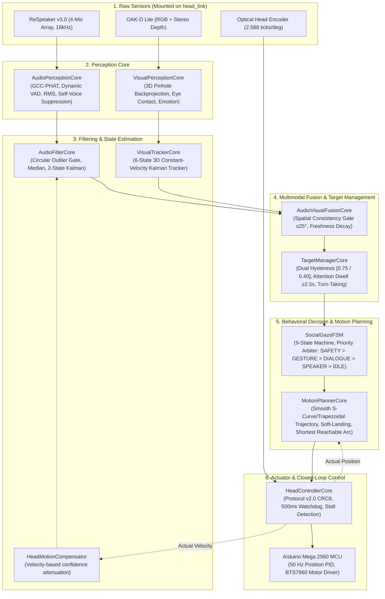

# ASTRO — Greenfield Social Robot Head Gaze System Architecture

## 1. Executive Summary

This document defines the greenfield architecture of the **ASTRO Social Robot Head Gaze & Audio-Visual Speaker Tracking System**. 

The architecture completely discards monolithic callback-driven control paradigms in favor of a strictly decoupled, feedback-controlled, and testable perception-control pipeline.

---

## 2. Architectural Principles & Guarantees

1. **Separation of Concerns:**  
   Perception never directly writes to motor registers or publishes raw angles to hardware. Every stage has a defined data contract dataclass (`AudioObservation`, `FilteredAudioState`, `VisualTargetTrack`, `FusedTarget`, `TargetState`, `GazeCommand`, `TrajectoryPoint`, `HeadFeedback`).
2. **Deterministic 50 Hz Control Loop:**  
   Motor trajectories are evaluated synchronously at $50\text{ Hz}$ ($20\text{ ms}$ interval), isolating sensor callback jitter from physical motor driving.
3. **Circular Angle Mathematics:**  
   All angular calculations strictly handle the $180^\circ / -180^\circ$ circular branch seam using `wrap_deg`, `angular_diff_deg`, and `circular_mean_deg`.
4. **Natural Social Dynamics:**  
   Implements psychological attention dwell times ($\ge 2.5\text{ s}$), deadbands ($\ge 3.0^\circ$), and organic soft-landing deceleration profiles.
5. **Multi-Speaker Turn-Taking:**  
   Allows an expedited switch when a new speaker speaks distinctly ($\ge 20^\circ$ separation) for $\ge 0.80\text{ s}$.
6. **Safety & Self-Suppression:**  
   Automatic self-voice suppression when the robot is speaking, motion self-noise confidence attenuation during head turns, and hardware watchdog lockout if host-MCU communication is interrupted.

---

## 3. AI Support Layer Policy

The Cognitive Architecture Support Layer (`ros2_ws/src/astro_ai/astro_ai/brain/support/`) integrates external foundation models (Gemini Flash, Groq/Qwen) strictly as offline, out-of-band architectural assistance and review tooling.

### 3.1. Core Architectural Boundaries & Non-Negotiables
1. **Development-Time Support Only:** Gemini and Qwen operate solely as an asynchronous development-time support layer for architectural analysis, review, and verification. They are not part of runtime operations.
2. **Deterministic Cognitive Loop Isolation:** `CognitiveLoop.step()` and the 10 Hz realtime consciousness loop contain **zero** LLM calls, zero network sockets, and zero blocking operations.
3. **No Ground-Truth Authority:** LLMs are **not** the source of truth for ASTRO's runtime cognition, epistemic states, or operational history.
4. **Zero Motor / Behavioral Authority:** LLMs **cannot** emit `ActionIntent`, generate motor commands, or actuate hardware under any circumstances.
5. **No State Mutation:** LLMs cannot directly own, modify, or mutate `StateMachine`, `SelfState`, `SelfModel`, `CognitiveDecision`, or goals.
6. **Strict Mode Contracts (OBSERVE / PROPOSE / APPLY):**
   - `OBSERVE`: Read-only architectural inquiry. Strictly prohibited from proposing or making code changes.
   - `PROPOSE`: Produces structured, reviewable `ProposedChange` / `StructuredChangeProposal` objects with machine-verifiable fingerprints and risk ratings. Requires explicit human approval.
   - `APPLY`: Restricted development-time execution mode capable only of controlled workspace file modifications. Automatic git commit or push is strictly forbidden.
7. **Protected System Resources:** Sensitive configuration, database files, and security keys are permanently protected from context inclusion or modification:
   - `nemotron.py` and `ros2_ws/data/astro_cognitive.db` are strictly protected and immutable.
   - `.env`, hardware drivers, and credential files are permanently guarded by `PROTECTED_PATTERNS`.

### 3.2. Operational Policy Invariants
1. **Sparse Execution:**
   No per-cycle LLM invocation. LLMs are completely excluded from normal perception, world modeling, filtering, and cognition cycles.
2. **Event-Driven Invocation:**
   Triggered only by explicit events: intentional human developer review requests, significant epistemic ambiguity investigations, or explicit offline architectural audit workflows.
3. **Minimal Context:**
   Only the scoped `CognitiveContext`, designated relevant files, and the specific query are passed. Dumping full repository trees, unbroken conversation histories, or system logs into external model contexts is strictly prohibited. Token budgets are locally bounded and enforced before network calls.
4. **Bounded Output:**
   Responses are strictly bounded to compact JSON structures (`summary`, `observations`, `architectural_concerns`, `proposed_changes`, `invariant_checks`, `test_plan`, `confidence`). No open-ended conversational monologues or verbose narrative generation.
5. **Cache:**
   Identical architectural queries are hashed using deterministic SHA-256 keys (`topic`, `provider`, `context_hash`, `prompt_hash`) and resolved against the local SQLite cache (`ros2_ws/src/astro_ai/astro_ai/brain/support/cache.py`). Cache hits bypass provider network calls entirely.
6. **Cooldown / Debounce:**
   Consecutive requests on identical topics are debounced via topic-level cooldowns (`cooldown_seconds`), suppressing noisy or redundant external model calls.
7. **No Fallback Cascade:**
   If a provider call fails or hits rate limits, automatic cascading between providers (e.g. Gemini → Qwen) is prohibited (`allow_fallback=False` by default) to prevent uncontrolled quota consumption.
8. **No Continuous Self-Talk:**
   Autonomous internal LLM-to-LLM loops or continuous background self-dialogue are fundamentally disallowed.
